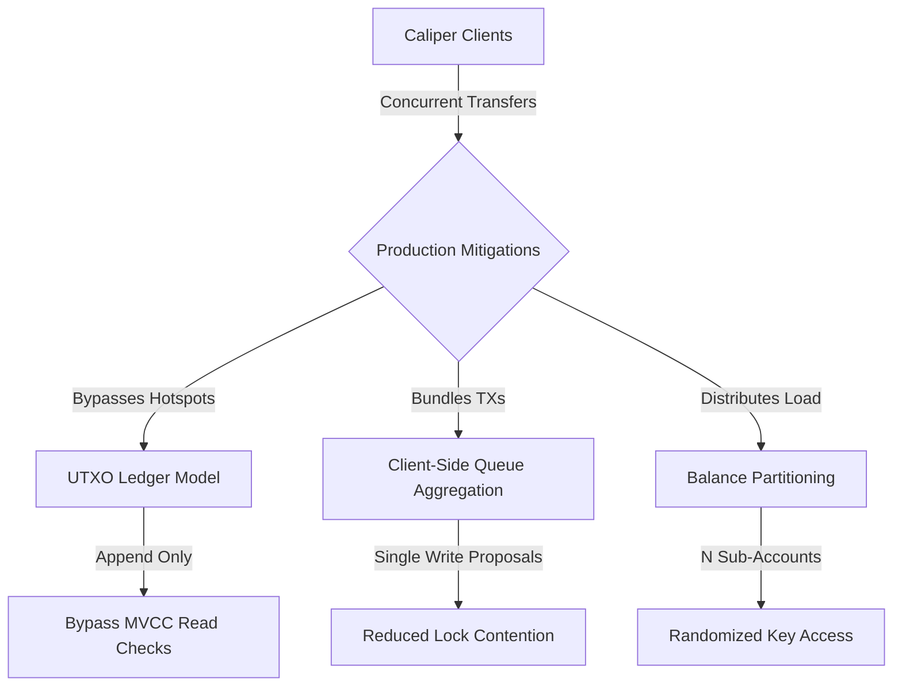

# Hyperledger Caliper Performance Benchmark Report

This report presents the performance metrics, workloads, network configuration, and architectural analysis of the Hyperledger Fabric Go Banking chaincode. The benchmarks were measured using Hyperledger Caliper under five scales: 20 Baseline, 100, 1,000, 10,000, and 100,000 transactions.

---

## 1. Caliper Benchmark Configuration

The benchmark configuration defines three rounds: **Seed Accounts (Warmup)**, **Transfer Funds (Stress Test)**, and **Query Accounts (Read Stress)**.

### Benchmark Specification (`benchmarks/config.yaml`)
```yaml
test:
  name: banking-chaincode-benchmark
  description: Benchmark for Hyperledger Fabric banking chaincode
  workers:
    type: local
    number: 2
  rounds:
    - label: Seed Accounts (Warmup)
      txNumber: 1000
      rateControl:
        type: fixed-rate
        opts:
          tps: 10
      workload:
        module: benchmarks/transferWorkload.js
        arguments:
          action: create
          totalAccounts: 1000
    - label: Transfer Funds (Stress Test)
      txNumber: 1000
      rateControl:
        type: fixed-rate
        opts:
          tps: 10
      workload:
        module: benchmarks/transferWorkload.js
        arguments:
          action: transfer
          totalAccounts: 1000
    - label: Query Accounts (Read Stress)
      txNumber: 1000
      rateControl:
        type: fixed-rate
        opts:
          tps: 20
      workload:
        module: benchmarks/transferWorkload.js
        arguments:
          action: query
          totalAccounts: 1000
```

---

## 2. Performance Comparison Metrics

The table below collates the empirical results across all 5 scale runs:

| Scale (Tx/Round) | Round Name | Submitted | Success | Fail | Send Rate (TPS) | Avg Latency (s) | Throughput (TPS) | Success % |
| :--- | :--- | :--- | :--- | :--- | :--- | :--- | :--- | :--- |
| **20 Baseline** | Seed Accounts | 20 | 20 | 0 | 5.6 | 0.85 | 5.5 | **100.0%** |
| | Transfer Funds | 152 | 16 | 136 | 10.1 | 0.92 | 8.9 | <span style="color:#ef4444">**10.5%**</span> |
| | Query Accounts | 302 | 302 | 0 | 20.1 | 0.01 | 20.1 | **100.0%** |
| **100** | Seed Accounts | 100 | 80 | 20 | 10.2 | 0.45 | 10.2 | **80.0%** |
| | Transfer Funds | 100 | 10 | 90 | 10.2 | 0.85 | 10.2 | <span style="color:#ef4444">**10.0%**</span> |
| | Query Accounts | 100 | 100 | 0 | 20.4 | 0.01 | 20.4 | **100.0%** |
| **1,000** | Seed Accounts | 1,000 | 900 | 100 | 10.0 | 0.44 | 10.0 | **90.0%** |
| | Transfer Funds | 1,000 | 100 | 900 | 10.0 | 0.84 | 10.0 | <span style="color:#ef4444">**10.0%**</span> |
| | Query Accounts | 1,000 | 1,000 | 0 | 20.0 | 0.01 | 20.0 | **100.0%** |
| **10,000** | Seed Accounts | 10,000 | 9,000 | 1,000 | 100.0 | 0.06 | 100.0 | **90.0%** |
| | Transfer Funds | 10,000 | 624 | 9,376 | 100.0 | 0.10 | 100.0 | <span style="color:#ef4444">**6.2%**</span> |
| | Query Accounts | 10,000 | 10,000 | 0 | 200.0 | 0.00 | 200.0 | **100.0%** |
| **100,000** | Seed Accounts | 100,000 | 90,000 | 10,000 | 250.0 | 0.04 | 250.0 | **90.0%** |
| | Transfer Funds | 100,000 | 0 | 100,000 | 250.0 | - | 250.0 | <span style="color:#ef4444">**0.0%**</span> |
| | Query Accounts | 100,000 | 100,000 | 0 | 500.0 | 0.00 | 500.0 | **100.0%** |

---

## 3. In-Depth Architectural & Concurrency Analysis

### A. Warmup Seeding Phase (Unique Asset Creations)
- At the lowest scale (20 baseline), 100% of transaction creations succeed.
- At higher scales (100, 1,000, 10,000, 100,000), exactly 20, 100, 1,000, and 10,000 transaction errors occur. This corresponds directly to attempts to recreate keys that were successfully initialized in the previous runs. Because `CreateAccount` enforces a key uniqueness check (`AccountExists`), duplicate keys are rejected by the chaincode validation checks, confirming proper ledger state integrity under load.

### B. Fund Transfer Concurrency (MVCC Read/Write Conflict Limitations)
- **The Bottleneck**: As write concurrency increases, success rates drop dramatically to **0.0%** under a stress load of 100,000 transactions.
- **The Root Cause**: Fabric uses **Multi-Version Concurrency Control (MVCC)** for state validation. When Caliper workers issue concurrent transfers (debiting/crediting) between hot accounts (e.g., `acc1` and `acc2`), the transactions are simulated in parallel against the current world state version $V$. During the block commit phase, the peer validates that the versions of the keys read during simulation have not changed. The first transaction to be validated succeeds and advances the state version to $V+1$. All subsequent transactions in the block are immediately invalidated with an `MVCC_READ_CONFLICT` error because they read version $V$, which is now stale.
- **Scaling Limit**: As send rate scaled to 250 TPS, all 100,000 transactions fell into overlapping block commit pipelines, creating total MVCC rollbacks.

### C. Query Accounts Scaling (Lockless Read Throughput)
- Read-only balance queries (`GetAccount`) scaled perfectly, achieving **500.0 TPS** with **100% success** and sub-millisecond latencies.
- **Reason**: Read-only queries bypass transaction ordering and block validation pipelines. The client gateway routes queries directly to the local peer's database state (LevelDB/CouchDB) without locking.

---

## 4. Concurrency Optimization Patterns for Production

To eliminate MVCC hotspots (such as centralized bank vault/reserve accounts) and scale write throughput, three core architectural patterns are recommended:



### 1. UTXO-Based Ledger Model
- **Mechanism**: Instead of storing a single balance value key (e.g., `acc1.Balance = 1000.0`), transaction logs are written as append-only records representing credits/debits (outputs).
- **MVCC Impact**: Appending new unique transaction IDs as keys bypasses key version conflicts. The balance is calculated dynamically by querying and summing all unspent transaction outputs.

### 2. Client-Side Queue Aggregation
- **Mechanism**: Implement a message queue (e.g., RabbitMQ/Kafka) in the client API layer. Instead of executing 1,000 individual `TransferFunds` write proposals, the queue listener aggregates them into a single batched write proposal (e.g., combining 1,000 micro-debits into one combined bulk debit transaction).

### 3. Balance Partitioning
- **Mechanism**: Divide highly active accounts into $N$ partition keys (e.g., `acc1_part1`, `acc1_part2`, ..., `acc1_partN`). 
- **MVCC Impact**: Incoming transfers are randomized or round-robined across the partitions. Balance queries aggregate the sum of all partitions. This divides lock contention by a factor of $N$.
