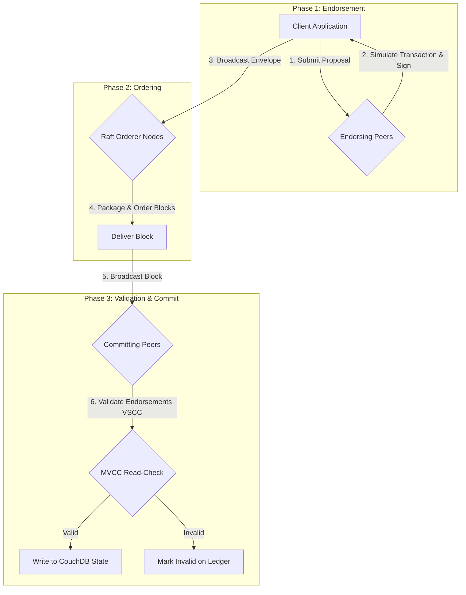

# End-to-End Hyperledger Fabric Endorsement & Transaction Flow

This document details the transaction execution flow in Hyperledger Fabric, showing exactly which nodes simulate, order, validate, and commit ledger state changes for each banking operation.

---

## 1. The 3-Phase Transaction Execution Lifecycle

Hyperledger Fabric uses an **Execute-Order-Validate** architecture. Every transaction goes through three distinct phases:

### Phase 1: Endorsement (Simulation)
1. The **Client Application** (e.g. [index.js](file:///Users/dhavalvarvariya/Downloads/CHARUSAT/D/banking-client/index.js)) sends a transaction proposal to specific **Endorsing Peers** determined by the endorsement policy.
2. The Endorsing Peers execute the smart contract function locally using a transient copy of the ledger state (simulation).
3. The peers generate a **Read-Write Set** (values read during simulation and values to be updated) and sign it using their cryptographic credentials (X.509 certs).
4. The endorsed proposal response is sent back to the Client Application. No state changes are committed yet.

### Phase 2: Ordering
1. The **Client Application** collects the required signatures/endorsements and packages them into a **Transaction Envelope**.
2. The Client sends this Envelope to the **Orderer Org** via gRPC.
3. The **Orderer Nodes** (Raft consensus) collect transactions from all clients, sort them chronologically, pack them into blocks, and sign the blocks.

### Phase 3: Validation & Committing
1. The Orderer broadcasts the ordered blocks to all **Committing Peers** on the channel.
2. Each Committing Peer validates the block:
   - **VSCC (Validation System Chaincode)**: Asserts that the signatures in the transaction envelope satisfy the defined **Endorsement Policy**.
   - **MVCC (Multi-Version Concurrency Control)**: Asserts that the key versions read during Phase 1 have not changed since simulation.
3. If validation succeeds, the peer updates CouchDB/LevelDB. If it fails, the transaction is written to the blockchain block but marked as **Invalid**, and no state updates are made.

---

## 2. Operation-Specific Node Routing & Policy Execution

Below is a detailed map of who does what for each action in the user journey:

### A. Account Creation (`CreateAccount`)
* **Endorsement Policy**: `OR('BankAMSP.member','BankBMSP.member')`
* **Workflow**:
  1. **Client Action**: Submits proposal targeting *either* `peer0.banka.example.com` OR `peer0.bankb.example.com`.
  2. **Simulation**: The selected peer checks if the account already exists and signs the read-write set.
  3. **Ordering**: The client broadcasts the single signature response to `orderer1.example.com`.
  4. **Validation/Commit**: All peers (Bank A, Bank B, and RegulatorOrg) receive the block. They verify that at least one commercial bank signature is present. If true, the account is committed.

### B. Inter-Bank Funds Transfer (`TransferFunds`)
* **Endorsement Policy**: `AND('BankAMSP.member','BankBMSP.member')`
* **Workflow**:
  1. **Client Action**: The client API must send proposal requests to **both** `peer0.banka.example.com` AND `peer0.bankb.example.com`.
  2. **Simulation**: Both peers simulate the debit and credit actions in parallel.
  3. **Ordering**: The client aggregates both signatures and submits the double-signed envelope to the orderers.
  4. **Validation/Commit**: Committing peers verify the presence of signatures from both BankAMSP and BankBMSP. If either signature is missing, the transaction is rejected as invalid.

### C. Loan Approval (`ApproveLoan`)
* **Endorsement Policy**: `AND('BankAMSP.member','RegulatorOrgMSP.member')`
* **Workflow**:
  1. **Client Action**: The branch manager client sends proposal requests to a Bank A peer and the RegulatorOrg peer (`peer0.regulator.example.com`).
  2. **Simulation**: The Bank A peer and Regulator peer verify the caller identity attributes (`role=branch_manager`) and add their MSP approval to the loan approvals map.
  3. **Ordering**: The dual-signed envelope is ordered.
  4. **Validation/Commit**: Peers confirm that both the commercial bank and the regulator approved.

### D. Private KYC Document Submission (`UploadKYCDocument`)
* **Endorsement Policy**: Collection-level validation: `OR('BankAMSP.member', 'RegulatorOrgMSP.member')`
* **Workflow**:
  1. **Client Action**: Client passes raw PII data (e.g. Social Security Numbers) in the **Transient Map** (not the public arguments) targeting Bank A and RegulatorOrg peers.
  2. **Simulation**: The target peers simulate the transaction and store the private write set inside a local **transient data store**.
  3. **Ordering**: The client submits the signatures and public hashes (cryptographic fingerprint of the document) to the orderer.
  4. **Validation/Commit**:
     - All peers commit the public transaction hash to the blockchain ledger.
     - **Only** Bank A and RegulatorOrg peers copy the actual private data from their transient store into their private database state. Bank B's peers receive only the public hash and have no visibility of the raw PII document.
