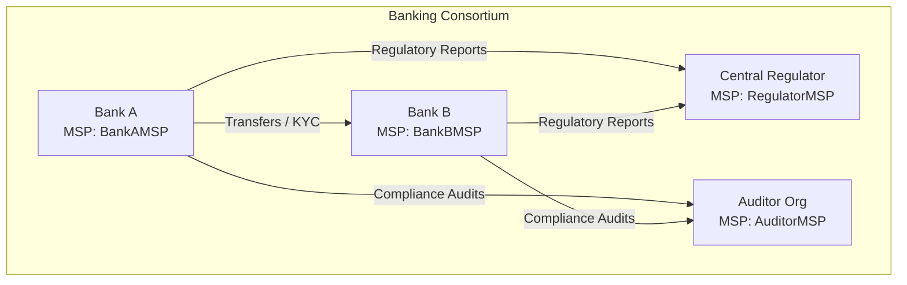

# Hyperledger Fabric Endorsement Policy Architecture for Banking Systems

This document outlines the recommended endorsement policy architecture, signature policy definitions, CLI lifecycle commands, Private Data Collection (PDC) configuration, State-Based Endorsement (SBE) implementation, and banking compliance mapping.

---

## 1. Network Topology & Organization Context

To establish a production-grade banking system, we define a consortium consisting of four organizations, each with distinct roles and Membership Service Providers (MSPs):



- **Bank A (`BankAMSP`) & Bank B (`BankBMSP`)**: Commercial banking entities executing peer-to-peer asset transfers, account creation, and user management.
- **Central Regulator (`RegulatorMSP`)**: The regulatory authority monitoring systemic risk, approving high-value transactions, and validating compliance.
- **Auditor Org (`AuditorMSP`)**: Third-party auditor verifying accounting integrity, credit risk reviews, and transaction ledger health.

---

## 2. Recommended Endorsement Policies per Operation Type

Fabric provides signature policies to define constraints on which organizations must endorse a transaction before committing it to the ledger. We use `AND`, `OR`, and `OutOf(M, ...)` operators.

| Operation Type | Risk Level | Target Operations | Recommended Signature Policy | Rationale |
| :--- | :--- | :--- | :--- | :--- |
| **Account Creation** | Medium | `CreateAccount` | `OR('BankAMSP.peer', 'BankBMSP.peer')` | Any commercial bank can provision its own customers. The regulator does not need to actively co-sign at creation time, but has full visibility via the shared channel ledger. |
| **P2P Inter-Bank Transfer** | High | `TransferFunds` | `AND('BankAMSP.peer', 'BankBMSP.peer')` | **Dual-Party Agreement**: Ensures both the sending bank (debited) and receiving bank (credited) validate and sign off on the state changes to prevent double-spending or unauthorized balance manipulation. |
| **High-Value P2P Transfer** | Critical | `TransferFunds` (> \$1M) | `AND('BankAMSP.peer', 'BankBMSP.peer', 'RegulatorMSP.peer')` | **Regulator Intervention**: Restricts high-value movements unless approved and signed by the Central Regulator's peer. |
| **Loan Approvals & Disbursement** | High | `ApproveLoan` | `AND(OR('BankAMSP.peer', 'BankBMSP.peer'), 'AuditorMSP.peer')` | Requires the issuing commercial bank and the Auditor Org to co-sign, ensuring credit risk assessments and compliance checks are verified. |
| **KYC / AML Updates** | High | `UpdateKYC` | `AND('RegulatorMSP.peer', OR('BankAMSP.peer', 'BankBMSP.peer'))` | Standard KYC templates are co-endorsed by the Regulator to ensure data standards are met, alongside the bank managing the customer. |
| **Balance Inquiries & Queries** | None | `GetAccount`, `GetAllAccounts` | N/A (Local Peer Query) | Read-only operations are queried against a local peer's database and do not submit transactions to the orderer, hence requiring no global endorsement policy validation on-chain. |

### Policy Syntax Breakdown & Trade-Offs

- **Majority-Based (`OutOf(M, N)`) vs. Specific-Org-Required (`AND` / `OR`)**:
  - **Majority-Based (`OutOf(2, 'BankAMSP.peer', 'BankBMSP.peer', 'RegulatorMSP.peer')`)**: 
    - *Pros*: Provides network high-availability (liveness). If the regulator peer is temporarily down for maintenance, Bank A and Bank B can still transact.
    - *Cons*: Bypasses mandatory regulatory sign-off for critical actions.
  - **Specific-Org-Required (`AND('RegulatorMSP.peer', OR(...))`)**:
    - *Pros*: Guarantees regulatory/auditor oversight. Ensures that no sequence of operations can bypass compliance verification.
    - *Cons*: Introduces a single point of failure (SPOF) if the regulator's endorsement node goes offline.

- **Regulatory/Audit use of `OutOf`**:
  - Useful when multiple auditors exist or when compliance checks can be federated. For example, `OutOf(1, 'RegulatorMSP.peer', 'AuditorMSP.peer')` specifies that either the Regulator OR the designated Auditor can validate a compliance override transaction.

---

## 3. Private Data Collections Config (`collections_config.json`)

To facilitate bilateral private transactions (e.g., loan terms, customer personal info, or OTC currency swaps) between Bank A and Bank B without exposing details to the Regulator or Auditor, we configure a Private Data Collection (PDC).

Create a file named `collections_config.json`:

```json
[
  {
    "name": "collectionBankABilateral",
    "policy": "OR('BankAMSP.member', 'BankBMSP.member')",
    "requiredPeerCount": 1,
    "maxPeerCount": 3,
    "blockToLive": 1000000,
    "memberOnlyRead": true,
    "memberOnlyWrite": true,
    "endorsementPolicy": {
      "signaturePolicy": "AND('BankAMSP.peer', 'BankBMSP.peer')"
    }
  }
]
```

### Config Parameter Explanation:
- **`policy`**: Restricts the distribution of private payloads to Bank A and Bank B members only.
- **`memberOnlyRead`/`memberOnlyWrite`**: Prevents the Regulator and Auditor from requesting or modifying the private state, even through query interfaces.
- **`endorsementPolicy`**: Requires updates to this private state to be endorsed by *both* commercial banks (`AND('BankAMSP.peer', 'BankBMSP.peer')`), safeguarding against unilateral modifications.

---

## 4. Deploying Chaincode with Endorsement Policies (Fabric Lifecycle)

When deploying or upgrading chaincode using the Fabric Lifecycle, the endorsement policy can be declared at the **Commit** phase using the `--signature-policy` flag.

Below are the CLI commands representing deployment for `banking-chaincode`.

### Step 1: Package the Chaincode
```bash
peer lifecycle chaincode package banking.tar.gz \
  --path ./banking-chaincode \
  --lang golang \
  --label banking_1.0
```

### Step 2: Install Chaincode on Peers (Executed on each org's peer)
```bash
# Executed on Bank A Peer
export CORE_PEER_TLS_ENABLED=true
export CORE_PEER_LOCALMSPID="BankAMSP"
export CORE_PEER_TLS_ROOTCERT_FILE=/opt/gopath/src/github.com/hyperledger/fabric/peer/crypto/peerOrganizations/banka.example.com/peers/peer0.banka.example.com/tls/ca.crt
export CORE_PEER_MSPCONFIGPATH=/opt/gopath/src/github.com/hyperledger/fabric/peer/crypto/peerOrganizations/banka.example.com/users/Admin@banka.example.com/msp
export CORE_PEER_ADDRESS=peer0.banka.example.com:7051

peer lifecycle chaincode install banking.tar.gz
```

### Step 3: Approve Chaincode Definition for each Org
We define the signature policy here. Let's enforce that updates to accounts default to requiring approval from either Bank A or Bank B: `OR('BankAMSP.peer', 'BankBMSP.peer')`.

```bash
# Query the package ID first
peer lifecycle chaincode queryinstalled

# Export the Package ID returned from queryinstalled
export CC_PACKAGE_ID="banking_1.0:hash_value_here"

# Approve the definition (run for Bank A, Bank B, Regulator, Auditor)
peer lifecycle chaincode approveformyorg -o orderer.example.com:7050 \
  --ordererTLSHostnameOverride orderer.example.com \
  --channelID banking-channel \
  --name banking \
  --version 1.0 \
  --package-id $CC_PACKAGE_ID \
  --sequence 1 \
  --tls \
  --cafile /opt/gopath/src/github.com/hyperledger/fabric/peer/crypto/ordererOrganizations/example.com/orderers/orderer.example.com/msp/tlscacerts/tlsca.example.com-cert.pem \
  --signature-policy "OR('BankAMSP.peer', 'BankBMSP.peer')"
```

### Step 4: Commit Chaincode with Signature Policy & PDC
When committing the chaincode, the `--signature-policy` enforces the default chaincode-level validation rules across the network. We also pass `--collections-config` for private data.

```bash
peer lifecycle chaincode commit -o orderer.example.com:7050 \
  --ordererTLSHostnameOverride orderer.example.com \
  --channelID banking-channel \
  --name banking \
  --version 1.0 \
  --sequence 1 \
  --tls \
  --cafile /opt/gopath/src/github.com/hyperledger/fabric/peer/crypto/ordererOrganizations/example.com/orderers/orderer.example.com/msp/tlscacerts/tlsca.example.com-cert.pem \
  --peerAddresses peer0.banka.example.com:7051 \
  --tlsRootCertFiles /opt/gopath/src/github.com/hyperledger/fabric/peer/crypto/peerOrganizations/banka.example.com/peers/peer0.banka.example.com/tls/ca.crt \
  --peerAddresses peer0.bankb.example.com:9051 \
  --tlsRootCertFiles /opt/gopath/src/github.com/hyperledger/fabric/peer/crypto/peerOrganizations/bankb.example.com/peers/peer0.bankb.example.com/tls/ca.crt \
  --signature-policy "OR('BankAMSP.peer', 'BankBMSP.peer')" \
  --collections-config ./collections_config.json
```

---

## 5. State-Based Endorsement (SBE) Implementation

While a chaincode-level endorsement policy applies to all keys modified by that smart contract, **State-Based Endorsement (SBE)** allows you to set specific endorsement policies for individual keys/assets directly from within the chaincode execution path.

This is critical for high-value accounts or VIP transactions that require regulatory oversight or dual-commercial-bank authorization, overriding the default `OR('BankAMSP.peer', 'BankBMSP.peer')` policy.

Here is how you can implement this in Go utilizing the Hyperledger Fabric shim package.

### SBE Go Implementation Example

Below is a Go helper function and integration code that can be embedded into the smart contract:

```go
package main

import (
	"encoding/json"
	"fmt"

	"github.com/hyperledger/fabric-chaincode-go/pkg/statebased"
	"github.com/hyperledger/fabric-contract-api-go/contractapi"
)

// ElevateAccountPolicy overrides a specific account key's endorsement policy.
// For example, if an account balance exceeds $1,000,000, updates to it must be signed by BOTH banks and the Regulator.
func (s *SmartContract) ElevateAccountPolicy(ctx contractapi.TransactionContextInterface, accountID string) error {
	// Create an state-based endorsement policy instance
	ep, err := statebased.NewStateBasedEndorsement(nil)
	if err != nil {
		return fmt.Errorf("failed to create state-based endorsement policy: %w", err)
	}

	// Add organizational MSPs that must endorse this specific key
	err = ep.AddOrgs(statebased.RoleTypePeer, "BankAMSP", "BankBMSP", "RegulatorMSP")
	if err != nil {
		return fmt.Errorf("failed to add orgs to endorsement policy: %w", err)
	}

	// Serialize the policy bytes
	policyBytes, err := ep.Policy()
	if err != nil {
		return fmt.Errorf("failed to serialize policy: %w", err)
	}

	// Apply the policy specifically to the target account's state key
	err = ctx.GetStub().SetStateValidationParameter(accountID, policyBytes)
	if err != nil {
		return fmt.Errorf("failed to set state validation parameter on account %s: %w", accountID, err)
	}

	return nil
}

// CreateHighValueAccount implements the creation and sets SBE
func (s *SmartContract) CreateHighValueAccount(ctx contractapi.TransactionContextInterface, id string, owner string, initialBalance float64) error {
	// 1. Create the account using standard logic
	err := s.CreateAccount(ctx, id, owner, initialBalance)
	if err != nil {
		return err
	}

	// 2. If it's a high-value account (>= $1M), elevate the policy
	if initialBalance >= 1000000.00 {
		err = s.ElevateAccountPolicy(ctx, id)
		if err != nil {
			return fmt.Errorf("failed to elevate policy for high-value account: %w", err)
		}
	}
	return nil
}
```

### How SBE changes transaction flow:
1. When a client invokes `TransferFunds` modifying `acc1` (which has the default policy) and `acc3` (which has the elevated policy because its balance is above \$1M), the client must collect signatures from **both** Bank A, Bank B, and the Regulator.
2. Fabric's Validation System (VSCC) checks validation parameters key-by-key at the commit phase. If the signatures for the modified key do not match the key-level policy, the transaction is marked invalid on-chain.

---

## 6. Mapping Architecture to Real Banking Compliance Needs

Fabric's cryptographic identity layer (MSP) and flexible policies align directly with institutional banking requirements:

### A. Maker-Checker / Dual Control
- In banking operations, one employee prepares a transaction (Maker) and another signs off (Checker). 
- Using signature policies, you can enforce that transactions containing inter-bank movements are not processed unless endorsed by both participating bank peers (`AND('BankAMSP.peer', 'BankBMSP.peer')`). This ensures no single bank can unilaterally forge a state transfer.

### B. Regulatory Visibility & Intervention
- The Central Regulator can configure read-only peers on the channel to continuously ingest state updates for AML (Anti-Money Laundering) checks.
- For high-risk transactions, requiring `RegulatorMSP` to sign off prevents compliance violations *before* they are finalized in the ledger, moving regulation from post-facto auditing to real-time enforcement.

### C. Non-Repudiation and Audit Trail
- Each endorsement signature is cryptographically bound to the transaction proposal response. Under the `AuditorMSP` policy checks, audit logs are tamper-proof and mathematically linked to the peer identities that authorized the ledger transition.
