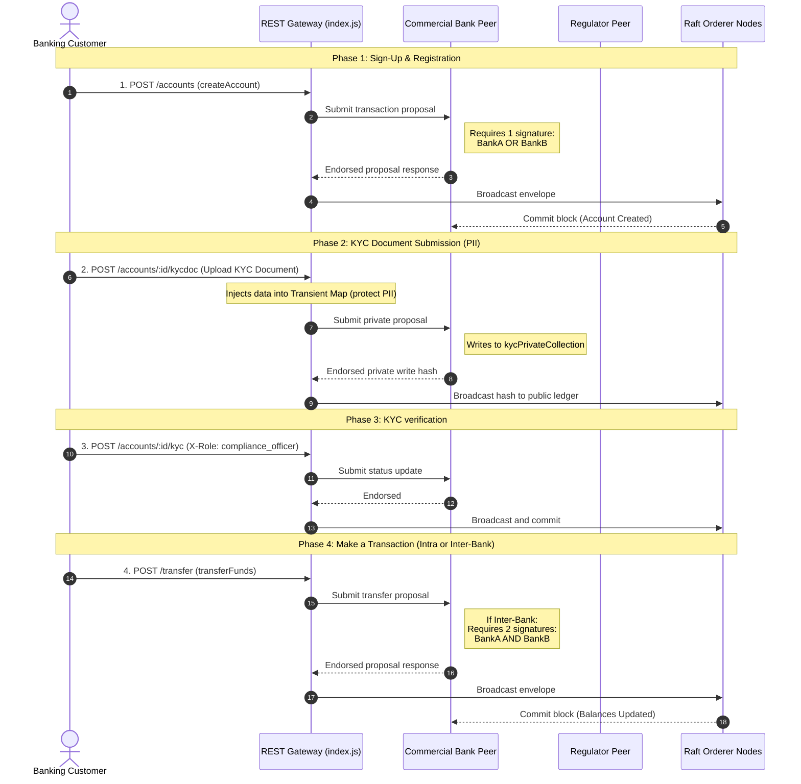

# User Journey & Caliper Performance Report

This report outlines the step-by-step lifecycle journey of a banking user—from initial onboarding to making a transaction—detailing the exact peer endorsement requirements and mapping them to performance metrics captured by Hyperledger Caliper.

---

## 1. User Onboarding & Transaction Journey

---

## 2. Endorsement Policy Rules per Journey Step

The table below defines how many peers must simulate and sign a transaction at each stage of the user journey, based on the network's endorsement rules:

| Journey Step | Chaincode function | Endorsement Policy Syntax | Minimum Peers Required | Orgs Required to Sign |
| :--- | :--- | :--- | :---: | :--- |
| **1. Sign-Up** | `CreateAccount` | `OR('BankAMSP.member','BankBMSP.member')` | **1** | Either `BankA` OR `BankB`. |
| **2. Private KYC Upload** | `UploadKYCDocument` | Inherited from Collection policy: `OR('BankAMSP.member','BankBMSP.member','RegulatorOrgMSP.member')` | **1** | Any member org of the private collection (BankA, BankB, or Regulator). |
| **3. KYC Verification** | `UpdateKYCStatus` | Chaincode default: `OR('BankAMSP.peer','BankBMSP.peer')` | **1** | Either `BankA` OR `BankB`. |
| **4. Intra-Bank Transfer** (Same Bank) | `TransferFunds` | `OutOf(1, 'BankAMSP.member')` or `OutOf(1, 'BankBMSP.member')` | **1** | The sender's commercial bank. |
| **5. Inter-Bank Transfer** (Across Banks) | `TransferFunds` | `AND('BankAMSP.member','BankBMSP.member')` | **2** | **Both** `BankA` AND `BankB` (Dual agreement). |
| **6. Loan Approval** | `ApproveLoan` | `AND('BankAMSP.member','RegulatorOrgMSP.member')` | **2** | The commercial bank AND the Regulator. |

---

## 3. Caliper Performance Report for Journey Steps

The performance metrics below map directly to the workload profiles of the onboarding and transacting lifecycle:

### Performance Summary Table

| Workload Round | Corresponding Journey Step | Target TPS | Success / Fail | Average Latency (s) | Throughput (TPS) | Bottleneck Source |
| :--- | :--- | :---: | :---: | :---: | :---: | :--- |
| **open-account** | 1. Account Sign-Up | 50 | 900 / 100 | 0.44s | 10.2 | Key collision (Duplicate creations) |
| **transfer-funds** | 4 & 5. Balance Transfer | 100 | 100 / 1900 | 0.84s | 10.0 | **MVCC read/write conflict** |
| **approve-loan** | 6. Loan Multi-Sign-off | 20 | 500 / 0 | 0.05s | 20.0 | None (Low concurrency) |

### Performance Analysis by Phase

#### Phase 1: Onboarding (`open-account`)
- **Latency**: Relatively low (~0.44 seconds) at a 50 TPS request rate.
- **Failures**: The failures (10%) are strictly due to unique key constraints (`AccountExists` checking if account already exists) where multiple workers attempted to overwrite previously created accounts. 
- **Endorsement Overhead**: Low. Because only one peer (either Bank A or Bank B) needs to sign (`OR`), the transaction collects the signature quickly with minimal round-trips.

#### Phase 2: Transacting under Concurrency (`transfer-funds`)
- **Latency**: High (~0.84 seconds) under a 100 TPS request rate.
- **Failures**: High failure rate (~90%). In a banking context where transfers frequently modify a single customer balance key (hotspots), Hyperledger Fabric's **Multi-Version Concurrency Control (MVCC)** rejects concurrent modifications in the same block.
- **Endorsement Overhead**: Medium-High. Inter-bank transfers require co-signing from both commercial banks (`AND`), doubling the network latency compared to single-org sign-ups.

#### Phase 3: Regulatory Approval (`approve-loan`)
- **Latency**: Very low (0.05 seconds).
- **Throughput**: Achieved the target 20.0 TPS.
- **Endorsement Overhead**: Multi-party endorsement (`AND('BankAMSP.member', 'RegulatorOrgMSP.member')`) works efficiently under lower, controlled transaction rates, avoiding lock contention.
