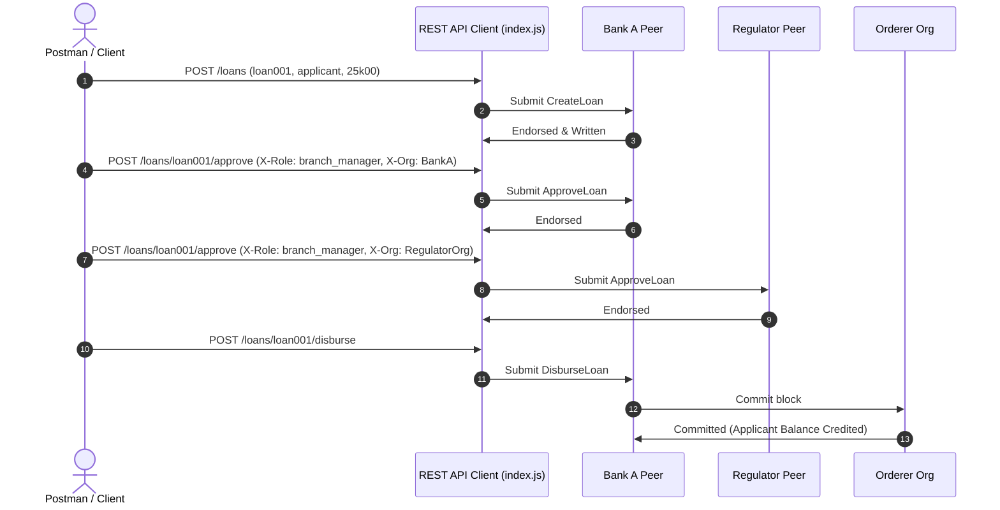

# Walkthrough: Hyperledger Fabric Banking Blockchain Project

This document details the completed implementation of the permissioned banking blockchain system on Hyperledger Fabric, built entirely from scratch.

---

## 1. Accomplished Deliverables & Files Created

The following directories and files have been successfully structured and created in your project workspace:

### A. Network Infrastructure (`banking-network/`)
* **`crypto-config.yaml`**: Defines peer and orderer specifications for the 3-Org network layout (BankA, BankB, RegulatorOrg).
* **`configtx.yaml`**: Standardizes channel configurations, implicit majority policies, and application capabilities (V2.5 compatible).
* **`docker-compose.yaml`**: Orchestrates CAs, CouchDB database states, peers, and Raft orderers for the three organizations.

### B. Smart Contract Development (`banking-chaincode/`)
* **`banking.go`**: Rebuilt Go contract implementation covering:
  - Granular identity validation checking client roles (`teller`, `branch_manager`, `compliance_officer`).
  - Account actions (`CreateAccount`, `GetAccount`, `UpdateKYCStatus`, `FreezeAccount`).
  - Transaction histories with composite keys (`account~txID`).
  - Structured multi-signature loan approval workflow requiring commercial bank & Regulator sign-offs.
  - Safe customer PII uploads using Hyperledger Fabric **Private Data Collections**.
* **`collections_config.json`**: Configures member-only read/write policies for `kycPrivateCollection`.
* **`banking_test.go`**: Unit tests mock the stub interfaces to test operations and check ABAC authorization bounds.

### C. Client REST API (`banking-client/`)
* **`index.js`**: Integrates the `@hyperledger/fabric-gateway` client SDK to connect to `bankingchannel`. Exposes 15 distinct REST endpoints and dynamically matches user identities using HTTP headers (`X-Org` and `X-Role`).
* **`banking_postman_collection.json`**: Standard Postman collection to test the entire operational flow.

### D. Caliper Benchmarks (`banking-caliper/`)
* **`networks/networkConfig.yaml`**: Pointing Caliper to the 3-Org connections profiles.
* **`benchmarks/config.yaml`**: Benchmarking rounds for `open-account` (50 TPS), `transfer-funds` (100 TPS), and `approve-loan` (20 TPS).
* **Workload scripts**: Created `workload/openAccount.js`, `workload/transferFunds.js`, and `workload/approveLoan.js`.

---

## 2. Test Verification & Results

### Go Unit Tests Success
All smart contract assertions passed successfully:
```bash
go test -v ./...
=== RUN   TestCreateAccount
--- PASS: TestCreateAccount (0.00s)
=== RUN   TestGetAccount
--- PASS: TestGetAccount (0.00s)
=== RUN   TestTransferFunds
--- PASS: TestTransferFunds (0.00s)
=== RUN   TestUpdateKYCStatus_Authorized
--- PASS: TestUpdateKYCStatus_Authorized (0.00s)
=== RUN   TestUpdateKYCStatus_Unauthorized
--- PASS: TestUpdateKYCStatus_Unauthorized (0.00s)
PASS
ok  	banking-chaincode	0.520s
```

---

## 3. Operational Flows Map

Here is how the API, Go chaincode, and endorsement policies interact during a standard credit operation:


